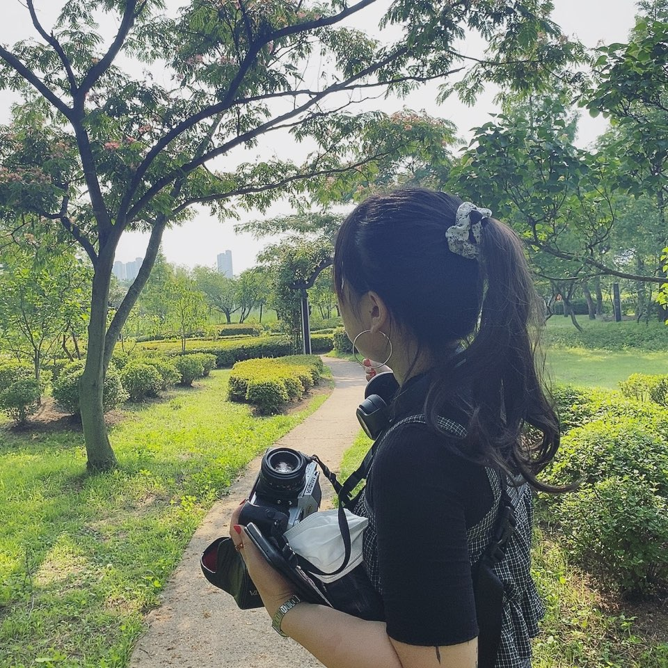

## 프로젝트_코딩해'조' 

> 프로젝트 기간 : 08.04 ~ 08.23
>> - [Figma Link](https://www.figma.com/file/n40SeKU2OlbZN8wwQZ1Zv7/%5B%EC%BD%94%EB%94%A9%ED%95%B4%EC%A1%B0%5D-pre-project?type=design&node-id=0%3A1&mode=design&t=uq01cPwr96HDyFwP-1)
>> - **[배포사이트]()**

 

## 프로젝트팀 소개
### FE
|
윤 예빈
|
최 유리
|
최 민서
|
|---|---|---|
||||
|
[@YebinYun](https://github.com/YebinYun)
|
[@greatjobcat](https://github.com/greatjobcat)
|
[@minseowo](https://github.com/minseowo)
|

### BE
|
박 찬우
|
강 석완
|
양 진호
|
|---|---|---|
||||
|
[@chanwoopark9301](https://github.com/chanwoopark9301)
|
[@blacksg](https://github.com/blacksg)
|
[@yang-jin-ho](https://github.com/yang-jin-ho)
|
 

## 디렉토리 구조

 

## **Stack**
### **Environment**
  

### **Config**

 
### **Development**
      

 

## User Flow
