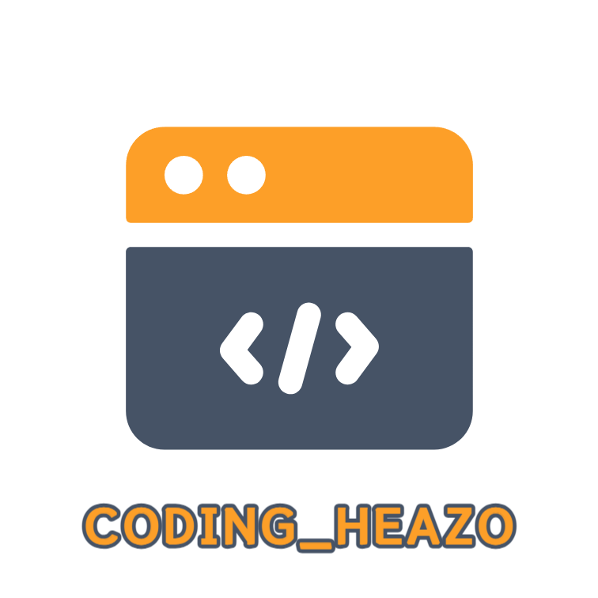

## 프로젝트_코딩해'조' 

> 프로젝트 기간 : 08.04 ~ 08.23
>> - [Figma Link](https://www.figma.com/file/n40SeKU2OlbZN8wwQZ1Zv7/%5B%EC%BD%94%EB%94%A9%ED%95%B4%EC%A1%B0%5D-pre-project?type=design&node-id=0%3A1&mode=design&t=uq01cPwr96HDyFwP-1)
>> - **[배포사이트](http://pre-project-deploy.s3-website.ap-northeast-2.amazonaws.com)**

 

## 프로젝트팀 소개
### FE
|
윤 예빈
|
최 유리
|
최 민서
|
|---|---|---|
||||
|
[@YebinYun](https://github.com/YebinYun)
|
[@greatjobcat](https://github.com/greatjobcat)
|
[@minseowo](https://github.com/minseowo)
|

### BE
|
박 찬우
|
강 석완
|
양 진호
|
|---|---|---|
||||
|
[@chanwoopark9301](https://github.com/chanwoopark9301)
|
[@blacksg](https://github.com/blacksg)
|
[@yang-jin-ho](https://github.com/yang-jin-ho)
|

 

## Stack
### **Environment**
   

 
### **Front-End**

       

### **Back-End**
      

 

## 📝 Documents

 사용자 요구사항 정의서

 

 User Flow 

 

 테이블 설계도 

 

## 🍵Team Culture
### 회의 시간
- **10시 ~ 10시 30분 회의** : 구현할 내용/ 업무 분담/ 역할 분배
- **10시 30분 ~ 11시 회의** : 각 파트(FE/BE)에서 피드백 시간 (이슈 공유)
- **5시 ~ 6시 통합 회의** : 그날 진행 정도 확인 및 평가(브리핑) / merge 종합하는 시간

### 개발 관련 규칙
- 칸반 보드는 각 팀에서 찬우(BE) / 예빈(FE) 추가
- 쿠션어 사용
- 호칭 : (○○님)
- 질문은 명확하게, 피드백은 존중을 담아서
- 불참, 혹은 개인적인 이슈 생길 시 [팀장님 or 디스코드채널] 공유

 

## ✨ Git Commit Type
### [태그] 제목

 

|태그|설명|
|---|---|
|Feat|새로운 기능 추가|
|Fix|버그 수정|
|Docs|문서 수정|
|Style|UI / style 개선|
|Refactor|코드 리팩토링|
|Test|테스트 코드, 리팩토링 테스트 코드 추가|
|Chore|빌드 업무 수정, 패키지 매니저 수정|

 

## 디렉토리 구조

